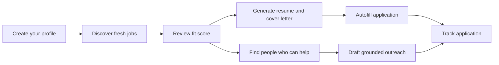
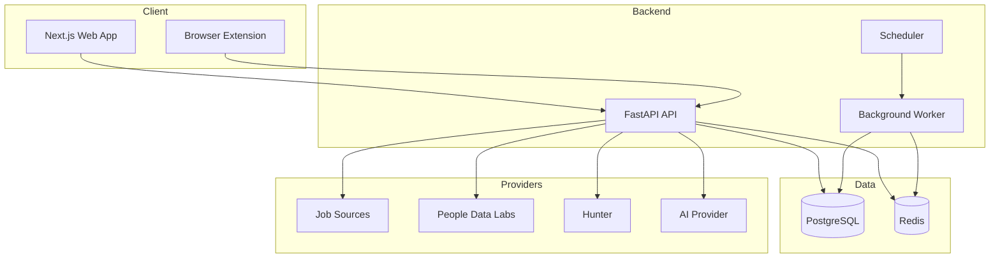

<div align="center">

# 🧭 JobPilot AI

### Discover better jobs. Build stronger applications. Reach the right people.

JobPilot AI is an end-to-end job search workspace that helps candidates discover fresh roles, understand their fit, generate tailored application materials, autofill common ATS forms, find relevant people at the hiring company, and track every application in one place.

<br />

[](https://www.typescriptlang.org/)
[](https://www.python.org/)
[](https://www.postgresql.org/)
[](https://redis.io/)
[](https://www.docker.com/)
[](https://developer.chrome.com/docs/extensions/)

<br />

**Discover · Match · Tailor · Apply · Connect · Track**

</div>

---

## ✨ Why JobPilot AI?

Job searching is fragmented. Candidates jump between job boards, resume tools, spreadsheets, networking platforms, and repetitive application forms.

JobPilot AI brings those workflows together:

| Step | JobPilot AI helps you |
|---|---|
| 🔎 **Discover** | Find recent jobs from official and public application sources |
| 🎯 **Match** | Score each job against your profile and explain the fit |
| 📝 **Tailor** | Generate ATS-friendly resumes and cover letters for the role |
| ⚡ **Apply** | Autofill common application forms through the browser extension |
| 🤝 **Connect** | Find likely recruiters, potential hiring managers, and referral candidates |
| 📊 **Track** | Keep saved, in-progress, and submitted applications organized |

---

## 🚀 Core Features

<table>
<tr>
<td width="50%" valign="top">

### 🔍 Fresh Job Discovery

- Search recent roles from supported public and official sources
- Filter by role, workplace type, fit score, and posting date
- Deduplicate repeated listings
- Preserve official application links
- Rank jobs using profile-aware matching

</td>
<td width="50%" valign="top">

### 🎯 Explainable Fit Scores

- Match titles, skills, experience, projects, and preferences
- Show why a role matches
- Highlight the strongest resume angle
- Use clear fit bands instead of a black-box recommendation

</td>
</tr>
<tr>
<td width="50%" valign="top">

### 📄 Tailored Application Materials

- Generate ATS-friendly resumes
- Create role-specific cover letters
- Keep education, projects, experience, and skills structured
- Avoid duplicated resume sections
- Preserve user review before use

</td>
<td width="50%" valign="top">

### ⚡ Browser Autofill

- Reuse one profile across applications
- Fill common text fields, dropdowns, and application questions
- Support multiple ATS patterns
- Keep the candidate in control of final review and submission

</td>
</tr>
<tr>
<td width="50%" valign="top">

### 🤝 People Who Can Help

- Find likely recruiters
- Identify potential hiring managers
- Surface relevant employees who may be good referral candidates
- Validate exact-company employment evidence
- Keep separate recruiter, manager, and referral search coverage
- Cache results and enforce provider budgets

</td>
<td width="50%" valign="top">

### 📬 Grounded Outreach

- Create distinct recruiter, manager, and referral messages
- Generate email, LinkedIn message, and connection-note formats
- Use only supported profile, job, and recipient facts
- Keep every draft editable
- Never send outreach automatically

</td>
</tr>
</table>

---

## 🧩 Product Flow



---

## 🤝 People Who Can Help

The networking workflow is designed for **precision before volume**.

JobPilot AI performs independently bounded searches for:

- **Likely recruiters**
- **Potential hiring managers**
- **Potential referral candidates**

The system then:

1. Matches the exact hiring company
2. Reviews current-employment evidence
3. Suppresses former, conflicting, stale, or related-company-only records
4. Scores role and category relevance
5. Places each person in their strongest category
6. Reuses cached results without charging for repeated card opens

### Data and outreach safeguards

- PDL is used for active people discovery
- LinkedIn URLs are displayed only when supplied by a licensed provider
- JobPilot AI does not scrape LinkedIn
- Email discovery is explicitly user-triggered
- Email patterns are never guessed
- Outreach drafts are grounded and never sent automatically

---

## 🏗️ Architecture



### Main stack

- **Frontend:** Next.js, React, TypeScript
- **Backend:** FastAPI, Python, Pydantic
- **Database:** PostgreSQL
- **Caching and coordination:** Redis
- **Infrastructure:** Docker Compose
- **Browser automation:** Chrome extension
- **People discovery:** People Data Labs
- **Work-email verification:** Hunter
- **Application intelligence:** AI-assisted matching and generation

---

## 📁 Repository Structure

```text
JobPilot-AI/
└── jobpilot-ai/
    ├── apps/
    │   ├── api/          # FastAPI backend, models, routes, migrations, tests
    │   ├── web/          # Next.js product UI
    │   └── extension/    # Browser autofill extension
    ├── docs/             # Architecture, privacy, providers, plans, reports
    ├── evaluation/       # People-recommendation evaluation tooling
    ├── docker-compose.yml
    ├── .env.example
    └── Makefile
```

---

## ⚙️ Getting Started

### Prerequisites

- Git
- Docker Desktop
- Node.js 20+
- Python 3.11+ for local backend development
- Chrome or a Chromium-based browser for the extension

### 1. Clone the repository

```bash
git clone https://github.com/cprakash64/JobPilot-AI.git
cd JobPilot-AI/jobpilot-ai
```

### 2. Create your environment file

```bash
cp .env.example .env
```

Fill in the required local configuration and provider credentials described in `.env.example`.

> Never commit `.env`, API keys, access tokens, provider payloads, or user data.

### 3. Start the application

```bash
docker compose up -d --build
```

### 4. Apply database migrations

```bash
docker compose exec api alembic upgrade head
```

### 5. Confirm readiness

```bash
docker compose ps
curl -sS http://localhost:8000/readyz
```

The web application is available at:

```text
http://localhost:3000
```

---

## 🧪 Development and Validation

### Backend

```bash
docker compose exec api pytest -q
```

### Web

```bash
cd apps/web
npm test
npm run lint
npm run typecheck
npm run build
```

### Useful repository checks

```bash
git diff --check
docker compose config
```

The project includes automated coverage for:

- Job discovery and fit scoring
- Company branding and logo safety
- Profile and tracker workflows
- People discovery and employment validation
- Provider budgets, caching, and usage accounting
- Frontend rendering and error states
- Browser extension behavior
- Database migrations and readiness

---

## 🔐 Privacy, Security, and Responsible Automation

JobPilot AI is built around user control.

- Applications are reviewed by the user before submission
- Outreach is drafted, not automatically sent
- Work-email lookup is user-triggered
- LinkedIn is not scraped
- Email addresses are not guessed
- Provider calls are bounded, cached, and budgeted
- Verified sensitive values are encrypted where retained
- Secrets are loaded through environment configuration
- Provider and application failures are represented honestly
- Old or conflicting employment evidence is suppressed rather than presented as fact

Read more in:

- `docs/people-data-privacy.md`
- `docs/people-data-providers.md`
- `docs/people-recommendation-scoring.md`
- `docs/people-observability.md`

---

## 🗺️ Roadmap

- [x] Profile-based job matching
- [x] Fresh job discovery
- [x] Fit-score explanations
- [x] Resume and cover-letter generation
- [x] Application tracking
- [x] Browser autofill foundation
- [x] Recruiter, manager, and referral discovery
- [x] Employment-evidence validation
- [x] Provider budgeting, caching, and durable usage accounting
- [ ] Wider ATS autofill coverage
- [ ] Controlled Hunter email validation rollout
- [ ] Broader closed-beta evaluation
- [ ] More provider-backed profile coverage
- [ ] Production deployment and monitoring

---

## 🤝 Contributing

Contributions are welcome.

1. Fork the repository
2. Create a feature branch
3. Make focused changes
4. Add or update tests
5. Run validation locally
6. Open a pull request with a clear description

```bash
git checkout -b feature/your-feature
git commit -m "feat: describe your change"
git push origin feature/your-feature
```

For major product or architecture changes, open an issue first so the approach can be discussed.

---

## ⚠️ Project Status

> JobPilot AI is under active development. Core workflows are implemented and have been validated internally, but provider coverage and application-site behavior can vary.

JobPilot AI assists with job discovery and application preparation. Users remain responsible for reviewing the accuracy of their profile, materials, outreach, and submitted applications.

---

<div align="center">

### Built to make job searching more focused, transparent, and human.

**JobPilot AI** — from finding the role to finding the right person.

</div>
