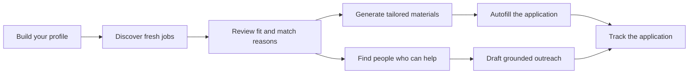
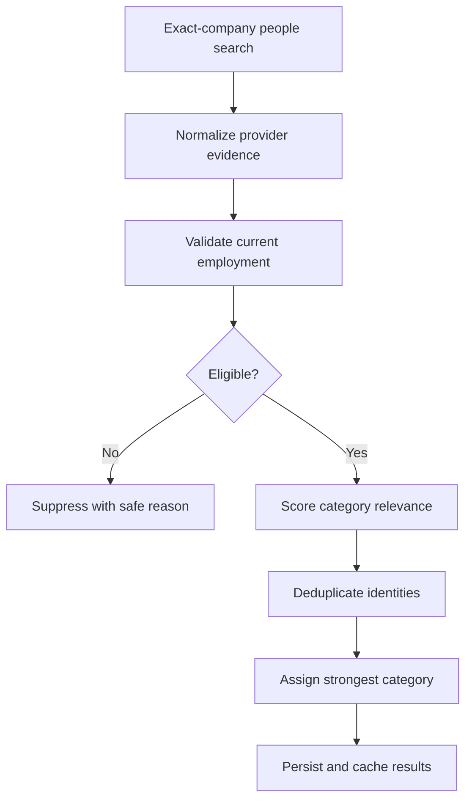
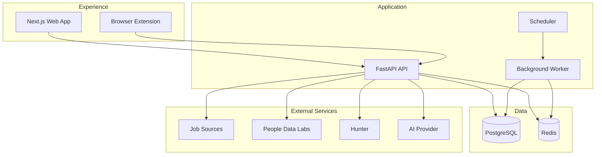

<div align="center">

<br />

# 🧭 JobPilot AI

### Your intelligent command center for the modern job search

**Discover fresh opportunities, understand your fit, tailor every application, reach the right people, and track everything from one place.**

<br />

[](https://nextjs.org/)
[](https://fastapi.tiangolo.com/)
[](https://www.postgresql.org/)
[](https://redis.io/)
[](https://www.docker.com/)
[](https://developer.chrome.com/docs/extensions/)

<br />

[Features](#-everything-you-need-in-one-workflow) •
[How It Works](#-how-jobpilot-ai-works) •
[Architecture](#-architecture) •
[Getting Started](#-getting-started) •
[Security](#-privacy-security-and-responsible-automation) •
[Roadmap](#-roadmap)

<br />

> **JobPilot AI turns a scattered job search into one focused workflow.**

<br />

</div>

---

## 🌟 What is JobPilot AI?

Most job seekers use five or six disconnected tools:

- job boards to find openings
- spreadsheets to track progress
- resume tools to tailor applications
- browser extensions to fill forms
- networking platforms to find recruiters and referrals
- notes and reminders to follow up

**JobPilot AI brings those workflows together.**

It helps candidates move from discovery to application with more context, better organization, and less repetitive work.

---

## ✨ Everything You Need in One Workflow

<table>
<tr>
<td width="50%" valign="top">

### 🔎 Discover Fresh Jobs

Find recent roles from supported public and official application sources.

- Filter by role, workplace, fit, and recency
- Prefer official application links
- Deduplicate repeated listings
- Keep only relevant opportunities
- Refresh results without losing your progress

</td>
<td width="50%" valign="top">

### 🎯 Understand Your Fit

See more than a generic match score.

- Profile-aware job scoring
- Clear fit bands
- Explainable match reasons
- Suggested resume angle
- Role, skill, and experience alignment

</td>
</tr>
<tr>
<td width="50%" valign="top">

### 📄 Tailor Every Application

Create job-specific application materials without rebuilding them from scratch.

- ATS-friendly resumes
- Role-specific cover letters
- Structured skills and experience
- Relevant project selection
- User review before use

</td>
<td width="50%" valign="top">

### ⚡ Autofill Application Forms

Use one profile across common ATS workflows.

- Fill text fields
- Handle common dropdowns
- Reuse profile answers
- Support multiple application patterns
- Keep final review and submission under user control

</td>
</tr>
<tr>
<td width="50%" valign="top">

### 🤝 Find People Who Can Help

Go beyond anonymous applications.

- Likely recruiters
- Potential hiring managers
- Relevant referral candidates
- Exact-company employment checks
- Separate category coverage
- Cached, budget-aware provider calls

</td>
<td width="50%" valign="top">

### 💬 Draft Better Outreach

Generate grounded outreach that sounds personal, not generic.

- Recruiter messages
- Hiring-manager messages
- Referral-candidate messages
- Email and LinkedIn formats
- Editable drafts
- No automatic sending

</td>
</tr>
<tr>
<td width="50%" valign="top">

### 📊 Track Every Application

Keep your job search organized.

- Saved roles
- In-progress applications
- Submitted applications
- Status changes
- Centralized application history

</td>
<td width="50%" valign="top">

### 🛡️ Keep Control

Automation should assist, not take over.

- No automatic application submission
- No automatic outreach
- No guessed email addresses
- No LinkedIn scraping
- Clear confidence and limitation states

</td>
</tr>
</table>

---

## 🚀 Why It Feels Different

| Traditional job search | JobPilot AI |
|---|---|
| Search across disconnected sites | One searchable discovery workspace |
| Guess whether a job is a fit | Explainable profile-aware fit scoring |
| Rewrite materials manually | Tailored resume and cover-letter workflows |
| Fill the same fields repeatedly | Browser-assisted autofill |
| Apply without knowing anyone | Recruiter, manager, and referral discovery |
| Track jobs in spreadsheets | Built-in application tracker |
| Send generic outreach | Grounded, recipient-aware drafts |

---

## 🧩 How JobPilot AI Works



### The workflow

1. **Create your profile**  
   Add your experience, projects, skills, education, preferences, and application answers.

2. **Discover recent jobs**  
   Search fresh opportunities and narrow them by role, workplace, fit, and posting date.

3. **Understand the match**  
   Review fit score, match reasons, and the strongest angle for your application.

4. **Tailor your materials**  
   Generate a role-specific resume and cover letter.

5. **Apply faster**  
   Use the browser extension to fill common application fields.

6. **Find relevant people**  
   Research likely recruiters, potential managers, and employees who may be good referral candidates.

7. **Track progress**  
   Keep every saved, active, and submitted application organized.

---

## 🤝 People Who Can Help

The networking engine is designed around **precision before volume**.

JobPilot AI performs independently bounded searches for:

<table>
<tr>
<td width="33%" align="center">

### 👤 Recruiters

Talent acquisition, technical recruiting, university recruiting, and related hiring roles.

</td>
<td width="33%" align="center">

### 🧑‍💼 Potential Managers

Engineering leaders and relevant function managers who may be connected to the role.

</td>
<td width="33%" align="center">

### 🧑‍💻 Referral Candidates

Relevant individual contributors working in a closely related function.

</td>
</tr>
</table>

The system then:



### Built-in safeguards

- Exact-company checks
- Current-employment evidence
- Former-employee suppression
- Conflicting-employment suppression
- Related-company separation
- Category-specific search quotas
- Request coalescing and caching
- Provider budget limits
- Durable usage accounting
- Read-only card reopen behavior

---

## 🧠 Grounded Outreach

Outreach drafts are created for the person’s likely relationship to the job.

| Contact type | Draft objective |
|---|---|
| Recruiter | Make the application easy to understand and review |
| Potential hiring manager | Show relevant experience and ask a focused team question |
| Referral candidate | Ask for perspective before requesting help |

JobPilot AI does **not** invent:

- mutual connections
- shared interests
- recruiter ownership
- hiring-team membership
- willingness to refer
- prior conversations
- unpublished knowledge

Every draft is editable and remains under the user’s control.

---

## 🏗️ Architecture



### Technology stack

<table>
<tr>
<td width="25%" align="center"><strong>Frontend</strong><br />Next.js<br />React<br />TypeScript</td>
<td width="25%" align="center"><strong>Backend</strong><br />FastAPI<br />Python<br />Pydantic</td>
<td width="25%" align="center"><strong>Data</strong><br />PostgreSQL<br />Redis<br />Alembic</td>
<td width="25%" align="center"><strong>Infrastructure</strong><br />Docker Compose<br />Workers<br />Scheduler</td>
</tr>
</table>

---

## 📁 Repository Structure

```text
JobPilot-AI/
├── README.md
└── jobpilot-ai/
    ├── apps/
    │   ├── api/             # FastAPI backend, models, migrations, tests
    │   ├── web/             # Next.js product interface
    │   └── extension/       # Browser autofill extension
    ├── docs/                # Architecture, privacy, providers, plans, reports
    ├── evaluation/          # Recommendation evaluation and review tooling
    ├── docker-compose.yml
    ├── .env.example
    └── Makefile
```

---

## ⚙️ Getting Started

<details open>
<summary><strong>1. Prerequisites</strong></summary>

<br />

Install:

- Git
- Docker Desktop
- Node.js 20+
- Python 3.11+ for local backend development
- Chrome or Chromium for extension development

</details>

<details>
<summary><strong>2. Clone the repository</strong></summary>

<br />

```bash
git clone https://github.com/cprakash64/JobPilot-AI.git
cd JobPilot-AI/jobpilot-ai
```

</details>

<details>
<summary><strong>3. Configure the environment</strong></summary>

<br />

```bash
cp .env.example .env
```

Add the local settings and provider credentials described in `.env.example`.

> Never commit `.env`, API keys, tokens, provider payloads, or user data.

</details>

<details>
<summary><strong>4. Start the application</strong></summary>

<br />

```bash
docker compose up -d --build
```

</details>

<details>
<summary><strong>5. Apply database migrations</strong></summary>

<br />

```bash
docker compose exec api alembic upgrade head
```

</details>

<details>
<summary><strong>6. Check readiness</strong></summary>

<br />

```bash
docker compose ps
curl -sS http://localhost:8000/readyz
```

Open the web app at:

```text
http://localhost:3000
```

</details>

---

## 🧪 Development

### Backend

```bash
docker compose exec api pytest -q
```

### Web

```bash
cd apps/web
npm test
npm run lint
npm run typecheck
npm run build
```

### Repository checks

```bash
git diff --check
docker compose config
```

### Covered areas

- Job discovery and matching
- Fit-score explanations
- Company branding and logo safety
- Profile and tracker workflows
- People discovery and category ranking
- Current-employment validation
- Provider budgets and usage accounting
- Frontend empty, loading, and error states
- Browser extension behavior
- Database migrations and readiness

---

## 🔐 Privacy, Security, and Responsible Automation

JobPilot AI is designed to assist the user without pretending certainty or removing control.

### Privacy principles

- User-triggered work-email lookup
- No guessed email patterns
- No LinkedIn scraping
- No automatic outreach
- No automatic application submission
- Encrypted retention for supported sensitive fields
- Provider call limits and caching
- Honest provider and confidence states
- Suppression of stale or conflicting employment data

### Security principles

- Environment-based secret management
- SSRF-aware external fetching
- Safe redirect handling
- Content-type and response-size validation
- Database migration checks
- Provider usage accounting
- Bounded retry and circuit-breaker behavior

Read more:

- `docs/people-data-privacy.md`
- `docs/people-data-providers.md`
- `docs/people-recommendation-scoring.md`
- `docs/people-observability.md`

---

## 📌 Current Status

| Area | Status |
|---|---|
| Job discovery | ✅ Implemented |
| Fit scoring | ✅ Implemented |
| Resume and cover-letter workflow | ✅ Implemented |
| Application tracker | ✅ Implemented |
| Browser autofill foundation | ✅ Implemented |
| Recruiter discovery | ✅ Implemented |
| Potential manager discovery | ✅ Implemented |
| Referral-candidate discovery | ✅ Implemented |
| Employment-evidence validation | ✅ Implemented |
| PDL usage, caching, and budgets | ✅ Implemented |
| Hunter live rollout | 🟡 Controlled validation pending |
| Wider beta evaluation | 🟡 In progress |
| Production deployment | 🟡 Planned |

---

## 🗺️ Roadmap

- [x] Profile-driven job discovery
- [x] Explainable fit scoring
- [x] Tailored resume generation
- [x] Tailored cover-letter generation
- [x] Application tracking
- [x] Browser autofill foundation
- [x] Recruiter, manager, and referral discovery
- [x] Exact-company employment validation
- [x] Provider caching and durable usage accounting
- [x] Category-specific referral coverage
- [ ] Controlled Hunter email validation
- [ ] Wider ATS compatibility
- [ ] Closed-beta evaluation
- [ ] Production monitoring and deployment
- [ ] Additional licensed data-provider coverage

---

## 🤝 Contributing

Contributions are welcome.

```bash
git checkout -b feature/your-feature
```

Then:

1. Make focused changes
2. Add or update tests
3. Run validation locally
4. Commit with a clear message
5. Open a pull request

```bash
git add .
git commit -m "feat: describe your change"
git push origin feature/your-feature
```

For major product or architecture changes, open an issue first.

---

## ⚠️ Important Note

JobPilot AI is under active development.

Provider coverage, application-site behavior, and role data can vary. Users remain responsible for reviewing:

- profile information
- match explanations
- generated materials
- contact recommendations
- outreach drafts
- submitted applications

JobPilot AI is an assistant—not an autonomous applicant.

---

<div align="center">

<br />

## Built for job seekers who want more clarity and less busywork

### **Discover better roles. Apply with confidence. Reach the right people.**

<br />

**JobPilot AI**

<br />

</div>
